<div align="center">



<br/>

<a href="https://fatihozkurt.com">🌐 <b>Portfolio</b></a>
&nbsp;&nbsp;·&nbsp;&nbsp;
<a href="https://www.linkedin.com/in/fatihozkurt/">💼 <b>LinkedIn</b></a>
&nbsp;&nbsp;·&nbsp;&nbsp;
<a href="https://medium.com/@fatihozkurt">✍️ <b>Medium</b></a>
&nbsp;&nbsp;·&nbsp;&nbsp;
<a href="mailto:fatih.ozkurt21@gmail.com">✉️ <b>Email</b></a>

</div>

<br/>


## `01` — About

I'm a **Java Backend Developer** with hands-on experience working on **production-grade enterprise backend systems**.

My work focuses on backend challenges around **API integrations, data processing, messaging, caching, relational persistence, asynchronous workflows, reliability and performance**.

I enjoy going beyond framework abstractions to understand how backend technologies actually work — and turning that understanding into **maintainable engineering solutions**.

```text
fatih@backend:~$ profile

  role        → Java Backend Developer
  ecosystem   → Java / Spring Boot
  mindset     → understand the system, not only the abstraction
  interests   → data · messaging · APIs · distributed systems
  deepening   → gRPC · Protocol Buffers · HTTP/2
```


## `02` — Engineering Toolbox

<table>
<tr>
<td width="50%" valign="top">

### ☕ Core Backend

`Java` `Spring Boot` `Spring Data JPA` `Spring Security` `Microservices`

</td>
<td width="50%" valign="top">

### 🗄️ Data & Search

`PostgreSQL` `SQL` `Redis` `OpenSearch`

<sub>Relational Databases · Database Design · Data Modeling</sub>

</td>
</tr>

<tr>
<td width="50%" valign="top">

### 📨 Messaging

`Apache Kafka` `RabbitMQ`

<sub>Event-driven workflows · Async processing</sub>

</td>
<td width="50%" valign="top">

### 🔌 API Communication

`REST` `GraphQL` `SOAP` `gRPC`

<sub>API integration · Service communication</sub>

</td>
</tr>

<tr>
<td width="50%" valign="top">

### 🔄 Data Lifecycle

`Liquibase` `Flyway` `MinIO`

<sub>Schema migrations · Object storage</sub>

</td>
<td width="50%" valign="top">

### 🛠️ Engineering

`Docker` `Git` `Unit Testing`

<sub>Containerization · Version control · Testing</sub>

</td>
</tr>
</table>

<div align="center">

`Java`
&nbsp;→&nbsp;
`Spring`
&nbsp;→&nbsp;
`Data`
&nbsp;→&nbsp;
`Messaging`
&nbsp;→&nbsp;
`APIs`
&nbsp;→&nbsp;
`Production`

</div>

<br/>


## `03` — Current Focus

<div align="center">


</div>

> I like learning backend technologies from the inside out — understanding not only **how to use them**, but also **why they behave the way they do**.


## `04` — Activity

<div align="center">


<br/>

`commit`
&nbsp;→&nbsp;
`learn`
&nbsp;→&nbsp;
`build`
&nbsp;→&nbsp;
`improve`

</div>
